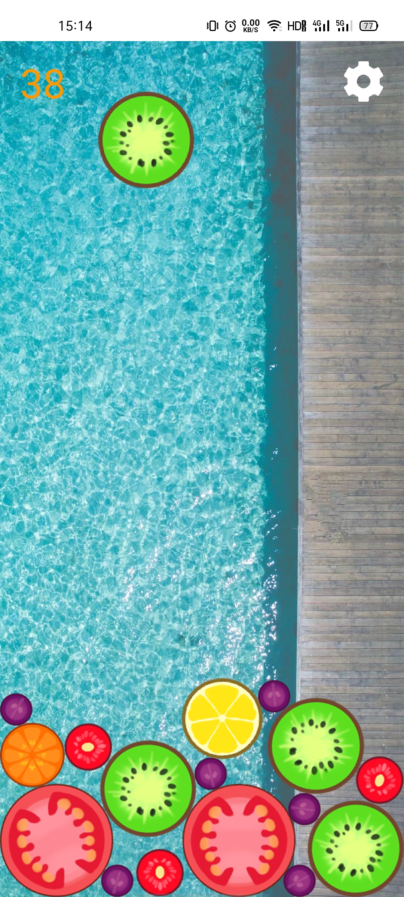

# 简介

合成大瓜是使用[Flutter](https://flutter.dev/)+[Flame](https://flame-engine.org/)+[Forge2D](https://github.com/flame-engine/forge2d)开发的一个开源小游戏。

我在[微伞小游戏](http://www.wesane.com/)开发的[《合成大西瓜》](http://www.wesane.com/game/654/)的基础上将其移植到 Flutter 平台，并添加了以下新特性：

- 支持自定义背景图
- 支持重力感应操控
- 支持修改图片素材
- 支持反向合成小瓜
- 支持只生成小/大瓜
- 内置多套游戏主题（水果/表情/校徽）

# 预览

|   |    |
| :------------: | :------------: |
|  |    |


# 在线预览

网页版：http://v.idoo.top/mix

安卓版：[合成大瓜.apk](release/合成大瓜.apk)

# 开发

Web端生成
```shell
flutter build web --release
```

Android端生成
```shell
flutter build apk --release
```

PS：亦可支持iOS，Mac，Windows，Linux端，请自行打包

# 相关文章

[趣学 Flutter「小游戏」：合成大瓜](https://juejin.cn/post/7082696847604580382)

# 免责声明

For learning purposes only. 

本游戏的创意玩法来自[《合成大西瓜》](http://www.wesane.com/game/654/)，应用内的素材收集自互联网，部分图片、音频素材版权归[微伞小游戏](http://www.wesane.com/)所有，侵删。

# 鸣谢

Flutter https://flutter.dev/

Flame https://flame-engine.org/

Forge2D https://github.com/flame-engine/forge2d

合成大西瓜 http://www.wesane.com/game/654/

